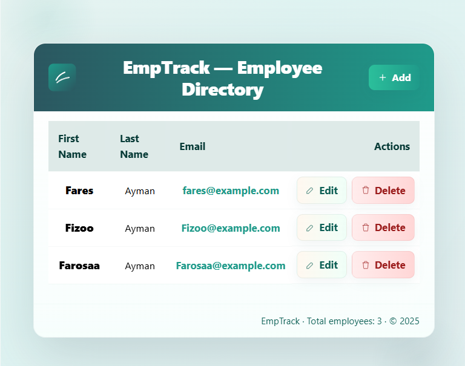
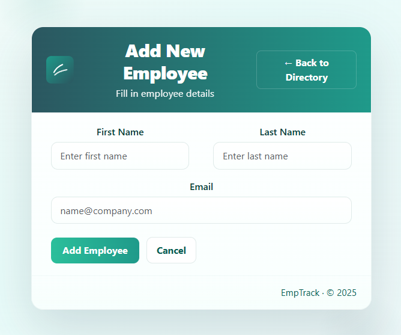
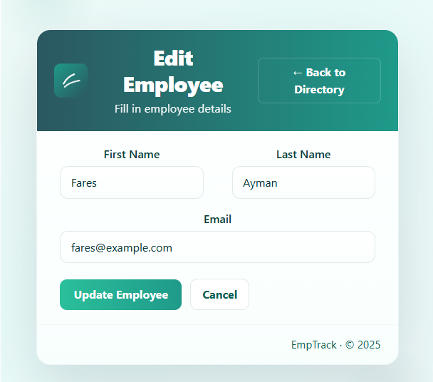

# Employee Management System

A full-stack Employee Management System built with React.js (frontend) and Spring Boot (backend), using MySQL as the database. This project allows managing employees with full CRUD operations and demonstrates integration between a modern frontend and a robust backend.

## Features

- **Backend (Spring Boot)**
  - RESTful API for employees
  - CRUD operations: Create, Read, Update, Delete
  - MySQL database integration
  - JPA/Hibernate for ORM

- **Frontend (React.js)**
  - Employee List page displaying all employees
  - Add Employee form with validation
  - Update Employee functionality with validation
  - Delete Employee with confirmation
  - Connected to backend API using Axios

## Project Structure
employee-management-system/
```
  ├── backend/
  │ ├── src/
  │ ├── pom.xml
  │ └── application.properties
  ├── frontend/
  │ ├── src/
  │ ├── package.json
  │ └── public/
  ├── README.md
  └── LICENSE
```
## Getting Started

### This repo has two parts, so you need to set up both:
- frontend: React + Vite
- backend: Spring Boot + Maven + MySQL

### A few important repo-specific notes first:
- The backend is set to Java 21 in backend/pom.xml, so use JDK 21 in VS Code.
- The frontend runs on port 3000 in frontend/vite.config.js.
- The frontend calls the backend at http://localhost:8080 in frontend/src/Services/EmployeeService.js.
- The backend expects MySQL database ems_db in backend/src/main/resources/application.properties.


### Prerequisites

- Java 17+
- Maven or Gradle
- Node.js 18+ and npm/yarn
- MySQL 5.7+ or 8+

### Download 

- [JDK 21](https://www.oracle.com/in/java/technologies/downloads/)
- [Node.js LTS](https://nodejs.org/en/download)
- [MySQL Server](https://dev.mysql.com/downloads/windows/installer/8.0.html)
- VS Code extensions: Extension Pack for Java, Spring Boot Extension Pack, ESLint
- Open in VS Code
- Open the root folder:

### Backend Setup

1. Navigate to the backend folder:
```bash
cd backend
.\mvnw.cmd clean install
```
This will download all Maven dependencies and build the backend.
2. In MySQL:
CREATE DATABASE ems_db;

Configure your MySQL database in application.properties:
```
  spring.datasource.url=jdbc:mysql://localhost:3306/employee_db
  spring.datasource.username=root
  spring.datasource.password=yourpassword
  spring.jpa.hibernate.ddl-auto=update
```
3. Run the Spring Boot application:
```
.\mvnw.cmd spring-boot:run
```
Backend will run on `http://localhost:8080`.

## Frontend Setup

1. Navigate to the frontend folder:

```
cd frontend
```

2. Install dependencies:
```
npm install
# or
yarn
```

3. Run the React app:
```
npm start
# or
yarn start
```

Frontend will run on `http://localhost:3000`.

## Usage

- Visit `http://localhost:3000` in your browser.  
- View the list of employees.  
- Use the **Add**, **Update**, and **Delete** buttons to manage employees.  
- All changes are synced with the backend API.  

## Future Improvements

- Add **authentication and role-based access** (Admin/User)  
- Implement **search and pagination** for employees  
- Add **unit and integration tests** for backend and frontend  
- Enhance UI with better styling and responsiveness  

## Tech Stack

- **Frontend:** React.js, Axios, HTML, CSS  
- **Backend:** Spring Boot, Spring Data JPA, MySQL, Hibernate  
- **Build Tools:** Maven/Gradle, npm/yarn

## Screenshots

### Employee List


### Add Employee


### Update Employee
